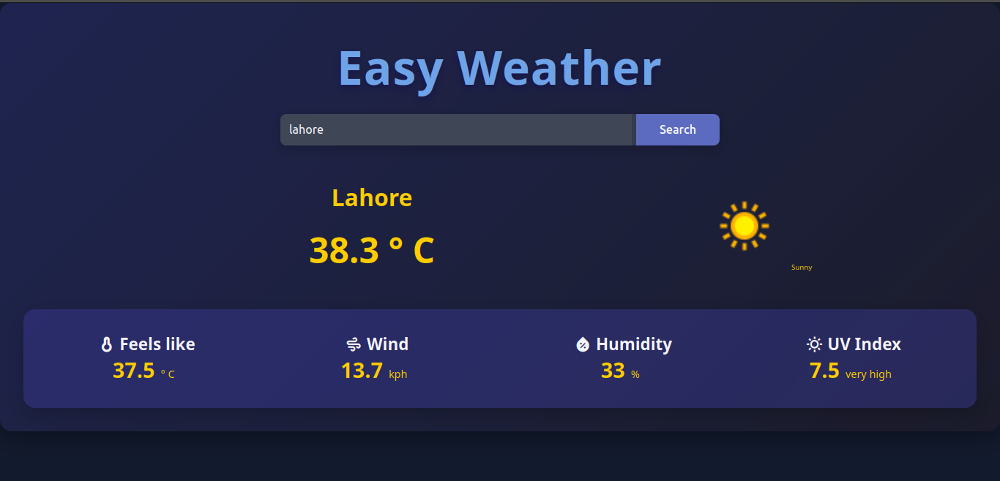

# 🌦 Easy-Weather App

A lightweight and beginner-friendly PHP application that allows users to search for real-time weather data of any city using the [WeatherAPI](https://www.weatherapi.com/). It displays current temperature, humidity, wind speed, UV index,feels like and also displays the relevant icon according to weather condition all within a clean and responsive UI.

---

## 📸 Demo


---

## 🚀 Features

- 🔍 City-based weather search
- 🌡️ Real-time temperature (°C)
- 💧 Humidity and wind speed
- 🌤️ Weather conditions with icons
- ☀️ UV index level indicator
- 🧼 Clean and responsive UI

---

## 🛠 Tech Stack

- **Frontend:** HTML, CSS  
- **Backend:** PHP  
- **API:** [WeatherAPI.com](https://www.weatherapi.com/)

---

## 📦 Installation

1. **Clone the repo:**
   ```bash
   git clone https://github.com/tayyab1251/easy-weather-app.git
   cd easy-weather-app
